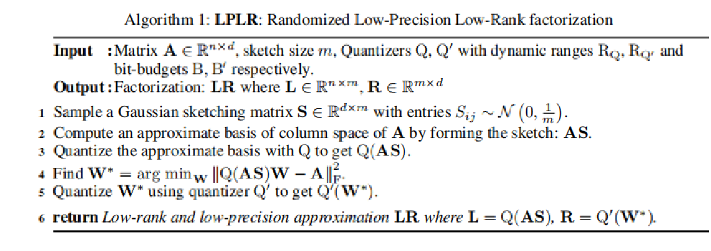
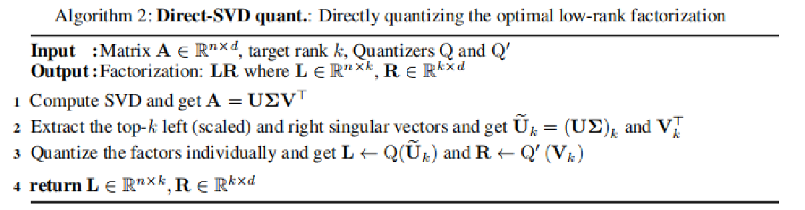
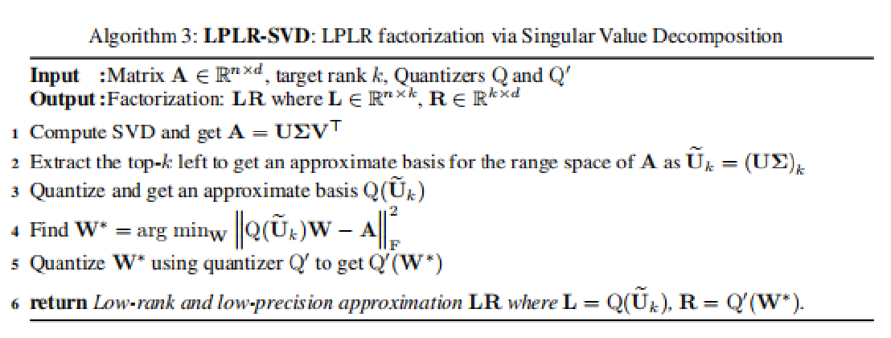

# matrix_compressor（高软作业）
   本项目所参考的论文：[Matrix Compression via Randomized Low Rank and Low Precision Factorization (neurips.cc)](https://proceedings.neurips.cc/paper_files/paper/2023/hash/3bf4b55960aaa23553cd2a6bdc6e1b57-Abstract-Conference.html)
## 项目功能介绍
  矩阵在各个研究领域中具有极大的用途，因为它提供了一个非常方便的框架来有序地组织和操作数据。然而，随着深度学习和大规模的发展，矩阵可能涉及数十亿个元素，以至于它们在计算资源和内存使用方面的存储和处理需求相当高。尽管这些矩阵非常庞大，但它们通常近似为低秩矩阵。
  
  因此，这篇论文提出了一种新的算法：**LPLR（Randomized Low-Precision Low-Rank factorization）**，将原始矩阵A进行低秩分解，即 $\mathbf{A} \approx \mathbf{L}\mathbf{R}$，其中 L 和 R 是低秩因子, $\mathbf{L} \in \mathbb{R}^{n \times m}$ ， $\mathbf{R} \in \mathbb{R}^{m \times d}$，所以L 和 R 中的元素总数显著少于 A 中的元素总数，矩阵A被压缩。将低秩因子L和R量化为低精度格式，即用少量的bit表示，以减少存储需求，同时牺牲了精度。
  
  **LPLR**
     
     
  **DSVD**
  
  
  **LSVD**
    
 

## 安装环境
安装环境
```
sh install.sh
```
激活环境
```
conda activate lplr
```
## 实验运行
**example.ipynb**： Shepp-Logan phantom 均匀抖动量化

**var_q.ipynb**： Shepp-Logan phantom 非对称量化

**lena.ipynb**： lena image 均匀抖动量化
